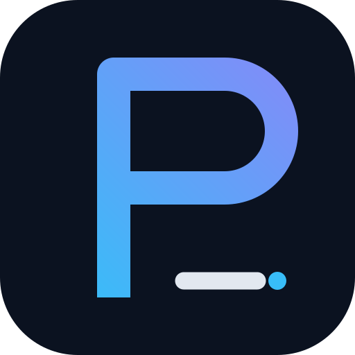

<div align="center">



# Prady Official Website

**Documentation · Playground · Download Hub for the Prady Programming Language**

[](https://pradylang.vercel.app)
[](https://vercel.com)
[](LICENSE)

**[🌐 Live Site](https://pradylang.vercel.app)** &nbsp;|&nbsp;
**[📖 Docs](https://pradylang.vercel.app/docs)** &nbsp;|&nbsp;
**[▶ Playground](https://pradylang.vercel.app/play)** &nbsp;|&nbsp;
**[⬇ Download](https://pradylang.vercel.app/download)**

</div>

---

## 🌐 Live Pages

| Page | URL | Description |
|---|---|---|
| 🏠 Home | [pradylang.vercel.app](https://pradylang.vercel.app) | Landing page with language overview |
| 📖 Docs Hub | [/docs](https://pradylang.vercel.app/docs) | Full documentation index |
| ▶ Playground | [/play](https://pradylang.vercel.app/play) | In-browser Prady runner & AST inspector |
| 🛠️ Error guide | [/errors](https://pradylang.vercel.app/errors) | Search an error with relevant code for targeted troubleshooting steps |
| ⬇ Download | [/download](https://pradylang.vercel.app/download) | Binary downloads for all platforms |

### 📚 Documentation Sub-pages

**Getting Started**
| Page | URL |
|---|---|
| 🚀 Overview & Philosophy | [/docs/getting-started/overview](https://pradylang.vercel.app/docs/getting-started/overview) |
| ⚡ Installation & Binaries | [/docs/getting-started/installation](https://pradylang.vercel.app/docs/getting-started/installation) |
| 💻 Hello World Tutorial | [/docs/getting-started/hello-world](https://pradylang.vercel.app/docs/getting-started/hello-world) |

**Handbook**
| Page | URL |
|---|---|
| 📖 The Basics | [/docs/handbook/the-basics](https://pradylang.vercel.app/docs/handbook/the-basics) |
| 🧩 Everyday Types | [/docs/handbook/everyday-types](https://pradylang.vercel.app/docs/handbook/everyday-types) |
| 🔄 Control Flow & Matching | [/docs/handbook/control-flow](https://pradylang.vercel.app/docs/handbook/control-flow) |
| λ Functions & Lambdas | [/docs/handbook/functions-and-lambdas](https://pradylang.vercel.app/docs/handbook/functions-and-lambdas) |
| 🏛️ Architecture Contracts | [/docs/handbook/architecture-contracts](https://pradylang.vercel.app/docs/handbook/architecture-contracts) |

**Language Reference**
| Page | URL |
|---|---|
| 🔤 Keywords & Grammar | [/docs/reference/keywords-and-syntax](https://pradylang.vercel.app/docs/reference/keywords-and-syntax) |
| 🏷️ Built-In Primitive Types | [/docs/reference/built-in-types](https://pradylang.vercel.app/docs/reference/built-in-types) |
| 🌲 All 28 Data Structures | [/docs/reference/data-structures](https://pradylang.vercel.app/docs/reference/data-structures) |
| 📚 Standard Library | [/docs/reference/standard-library](https://pradylang.vercel.app/docs/reference/standard-library) |

**Tooling & IDE**
| Page | URL |
|---|---|
| ⌨️ CLI Reference | [/docs/tooling/cli-reference](https://pradylang.vercel.app/docs/tooling/cli-reference) |
| 📦 Package Manager | [/docs/tooling/package-manager](https://pradylang.vercel.app/docs/tooling/package-manager) |
| 💡 VS Code & LSP | [/docs/tooling/editor-extensions](https://pradylang.vercel.app/docs/tooling/editor-extensions) |

---

## 🚀 Features

- **Interactive Playground** — In-browser syntax-highlighted editor, live parser diagnostics, error navigation and guidance, and a single-file interpreter at [pradylang.vercel.app/play](https://pradylang.vercel.app/play)
- **Error resolution guide** — Search known compiler/runtime messages with relevant source context at [pradylang.vercel.app/errors](https://pradylang.vercel.app/errors); source code stays in the browser
- **Cross-Platform Download Hub** — Windows (x64), macOS (Intel & Apple Silicon), Linux (x64 & ARM64) at [pradylang.vercel.app/download](https://pradylang.vercel.app/download)
- **Full Language Documentation** — Syntax guide, architecture validation rules, CLI reference, and quick-start tutorials
- **Astro-powered** — Fast static site with zero JS on most pages; Vercel Edge deployment

---

## 🛠️ Local Development

```bash
# Install dependencies
npm install

# Start dev server (http://localhost:4321)
npm run dev

# Build for production
npm run build

# Preview production build
npm run preview
```

---

## 🌍 Deployment

This site is configured for **automatic zero-configuration deployment on [Vercel](https://vercel.com)**.

- Pushing to `main` → auto-deploys to production at **[pradylang.vercel.app](https://pradylang.vercel.app)**
- `vercel.json` handles SPA routing and redirect rules
- `public/latest.json` drives the download page asset URLs — update it on each release

### Updating `latest.json` on Release

The hourly `Sync latest Prady release` workflow reads the newest complete compiler release and updates `public/latest.json`. It verifies that every platform archive, SHA-256 file, and installer exists before updating metadata. Use the workflow's **Run workflow** action to refresh it immediately after publishing.

---

## 🔗 Related Repositories

| Repo | Link |
|---|---|
| 🦀 Compiler (Rust) | https://github.com/technopradyumn/prady |
| 🔌 VS Code Extension | https://github.com/technopradyumn/vscode-prady |
| 🐛 Issues | https://github.com/technopradyumn/prady/issues |

---

## 📄 License

Licensed under **MIT OR Apache-2.0**. See [LICENSE](LICENSE) for details.
